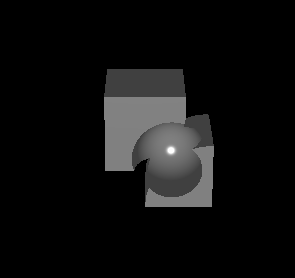

## Construction Solid Geometry Library
This is a library written in C that does CSG on triangle meshes. 

### Built from csg.js
It is built by mimicing a javascript library in C: [csg.js](https://github.com/evanw/csg.js/). Therefore, I included a copy of the javascript library to help understanding the functions. Every function used in the code are either commented, obvious, or has a counterpart in the corresponding class in csg.js. Example is that this function in CSGNode.h:
```
void CSGNodeBuild(CSGNode *node, CSGTriangleList *triangles);
```
corresponds to the `build()` function in Node class in csg.js.

### Run the demo
To run the code, run `make && ./csg` under the /code folder.
```
make && ./csg
```
You just have to look at the `meshInitialize()` function in main.c to understand the usage of the library and change the function to do more demos.

This is the result of the demo.



### Issues
There are still some unknown memory leaks. I tried to minimize the use of heap memory at first and thus used multiple pointers to point to the same memory in BSP construction and operations. However, when I try to clean up, the pointers overlap and the program give me "freeing unallocated memory" error. So I just do not destroy the BSP at all. Because of the time limit, I did not get time to fix them before I write this file.
